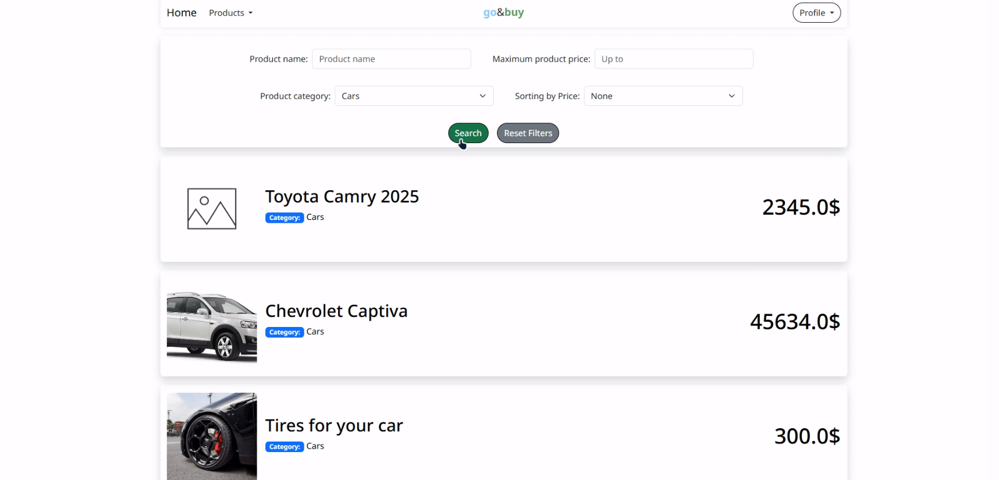
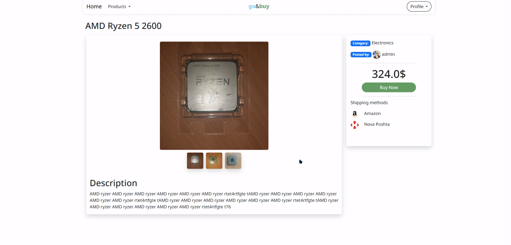
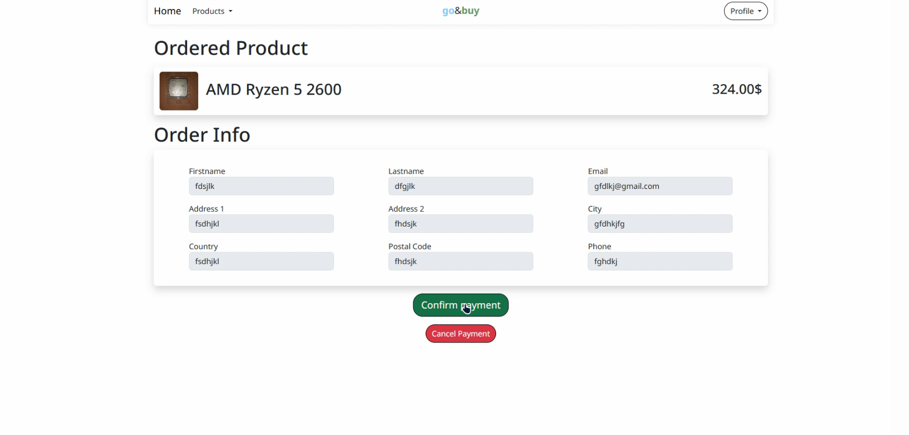
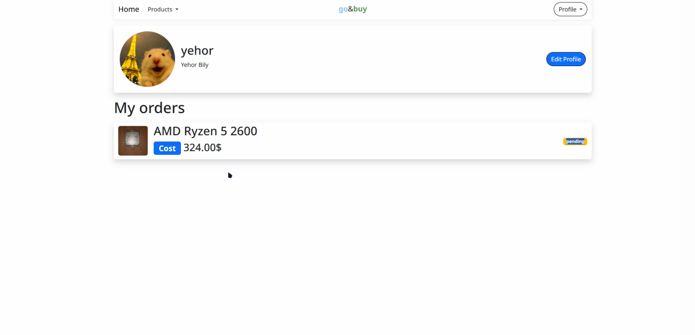
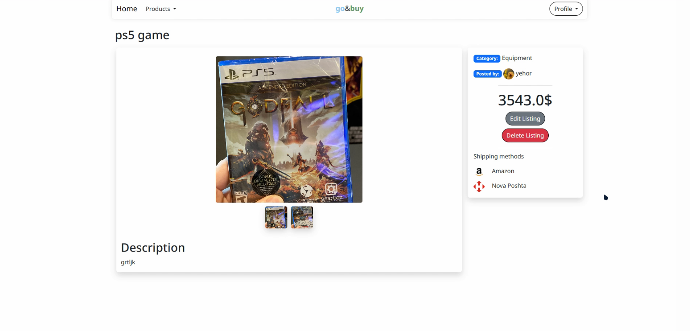
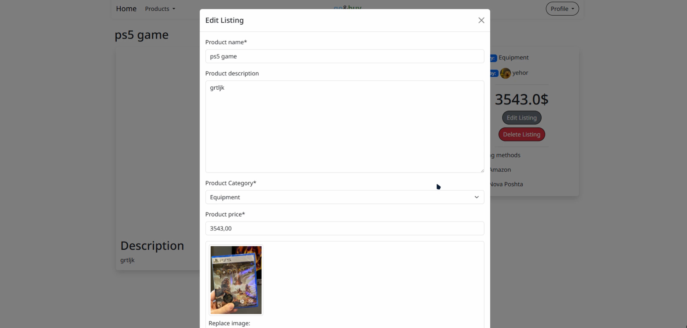

# Product Service

This is a web application for posting products to buy. This is OLX clone, ukrainian e-commerce service. Users can create, view, update, and delete listings, as well as make purchases.

### ⚙️ Key Features

- **Authentication**: User registration, login, and logout.
- **Profile Management**: Users can update their personal information.
- **Listings**: Users can create listings with photos, a description, and a price.
- **Search and Filtering**: Ability to search for listings by name, price, and category.
- **Order System**: Users can create orders to purchase products.
- **Stripe Integration**: Support for payments via Stripe using webhooks.
- **Responsive Design**: Uses Bootstrap for responsive display on various devices.

---

### 💻 Technologies

- **Backend**: Django
- **Database**: SQLite3 (for development)
- **Frontend**: HTML, CSS, JavaScript, Django Crispy Forms
- **UI Framework**: Bootstrap 5
- **Payments**: Stripe
- **Containerization**: Docker, Docker Compose

---

### 📸 Screenshots

<p align="center">
  
  
  
  
  
  
  
  
</p>

### 🚀 Local Setup

To run the project, you'll need [Docker](https://www.docker.com/get-started/) and [Docker Compose](https://docs.docker.com/compose/install/) installed on your computer.

1.  **Clone the repository**:

    ```bash
    git clone [URL-your-repository]
    cd [your-project-name]
    ```

2.  **Configure environment variables**:
    Create the **`.env`** and **`.env.stripe`** files in the root directory of the project (next to `docker-compose.yml`) and add your keys to them.

    `.env`

    ```env
    STRIPE_SECRET_KEY=yourkey
    STRIPE_PUBLIC_KEY=yourkey
    STRIPE_WEBHOOK_SECRET=yourkey
    # ... other variables, if any
    ```

    `.env.stripe`

    ```env
    STRIPE_API_KEY=yourkey
    ```

3.  **Run Docker Compose**:
    This command will build the images, start the containers, and run database migrations.

    ```bash
    docker compose up --build
    ```

    After a successful launch, your application will be available at: `http://localhost:8000`

---

### 🛠️ Usage

- **Create a superuser**:
  To access the Django admin panel, you need to create a superuser.

  ```bash
  docker-compose exec web python manage.py createsuperuser
  ```

- **Access the admin panel**:
  After creating a superuser, you can log in to the admin panel at `http://localhost:8000/admin`.

---

### ✅ Testing Stripe

For local Stripe webhook testing, your `docker-compose.yml` already includes a `stripe-cli` service. It automatically forwards events from your Stripe account to your local application.

To test:

1.  Ensure the `stripe-cli` service is running (use `docker-compose up`).
2.  Create a test payment in your application.
3.  The Stripe webhook will be forwarded to your application, allowing you to simulate real payment events.

---
